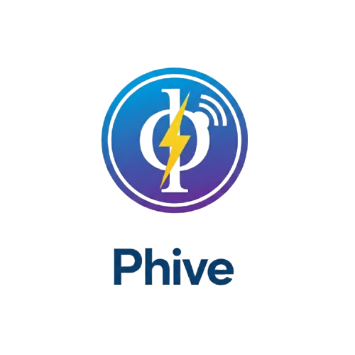

# Phive (PHP Live Server) 🚀

Phive est une extension VS Code légère qui transforme votre environnement de développement PHP en une expérience "Live" moderne.

## ✨ Fonctionnalités

- **Go Live instantané** : Lancez un serveur PHP interne en un clic.
- **Live Reload** : Vos navigateurs (PC et mobiles) se rafraîchissent automatiquement dès que vous sauvegardez un fichier `.php` ou `.html`.
- **Partage Réseau** : Accédez à votre site via votre IP WiFi pour tester directement sur smartphone ou tablette.
- **Logs Intégrés** : Suivez les requêtes entrantes en temps réel avec un compteur précis.

## 🛠️ Prérequis

- **PHP** doit être installé sur votre machine et ajouté à votre variable d'environnement PATH.

## 🚀 Utilisation

1. Ouvrez un dossier contenant des fichiers PHP.
2. Cliquez sur le bouton **$(play) Phive: Go Live** dans la barre de statut (en bas à droite).
3. Votre navigateur s'ouvre automatiquement.
4. Modifiez votre code, sauvegardez... et admirez le résultat !

## 📄 Licence

Ce projet est sous licence MIT.

---
Développé avec ❤️ par **fomadev**